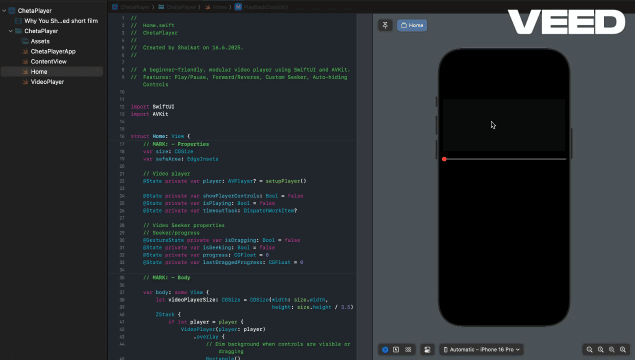

# ChetaPlayer



A modular, beginner-friendly SwiftUI video player inspired by YouTube. This project demonstrates custom playback controls, an interactive progress bar, and adaptive layout best practices, all written with clarity and extensibility in mind.

---

## 📚 Introduction

ChetaPlayer is designed as a hands-on learning resource for junior iOS developers. It showcases how to build a modular, customizable video player using SwiftUI and AVKit, with a focus on clean architecture, reusability, and modern iOS UI/UX patterns.

---

## ✨ Features
- Custom video player using AVKit
- Play, Pause, Forward, and Reverse controls
- Interactive, draggable progress (seeker) bar
- Auto-hiding playback controls for a clean UI
- Adaptive layout with GeometryReader and safe area insets
- Modular color palette and easy theme customization
- Well-commented, beginner-friendly code

---

## 🎯 Learning Objectives
- Understand SwiftUI view composition and state management
- Learn how to integrate AVKit for video playback
- Build reusable UI components (e.g., custom buttons, progress bar)
- Handle gestures and user interaction in SwiftUI
- Apply best practices for modular code and clean architecture
- Practice customizing and extending a real-world SwiftUI project

---

## 🚀 Getting Started
1. **Clone the repo:**
   ```bash
   git clone https://github.com/shaikat1993/ChetaPlayer.git
   ```
2. **Open in Xcode:**
   - Open `ChetaPlayer.xcodeproj` or `.xcworkspace`.
3. **Add a video file:**
   - Place your `.mp4` in the project bundle or use the provided sample.
4. **Run the app:**
   - Select a simulator or device and press ▶️.

---

## 🛠 How It Works
- **Custom VideoPlayer:** Uses AVKit with default controls hidden, so you can build your own UI.
- **Playback Controls:** Modular HStack with reusable button components for play, pause, forward, and reverse.
- **Seeker Bar:** Interactive progress bar with a draggable thumb, updating as the video plays.
- **Adaptive Layout:** Uses GeometryReader and safe area insets for responsive design across devices.
- **State Management:** SwiftUI @State and @GestureState for smooth UI updates and gesture handling.

---

## 🤝 Contributing
Contributions, questions, and suggestions are welcome! Feel free to open issues or submit pull requests to help make ChetaPlayer even better for learners.

---

## 📄 License
MIT License. See [LICENSE](LICENSE) for details.
